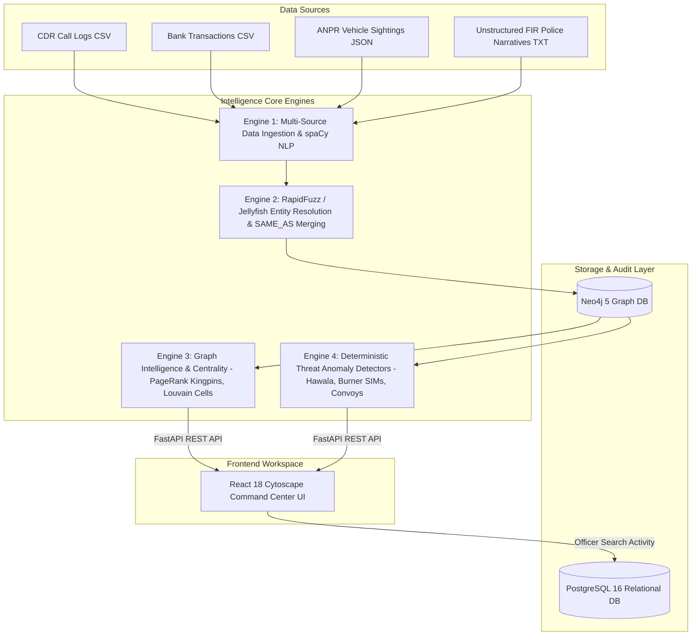

# SIH26189: AI-Powered Criminal Network Analysis Platform

An autonomous intelligence platform built for law enforcement agencies (State Police Cyber Cells, NCRB, Ministry of Home Affairs) to ingest, extract, resolve, and analyze complex criminal network entities across FIRs, Call Detail Records (CDRs), Bank Transactions, and ANPR Surveillance feeds.

---

## 🚀 One-Command Docker Setup

The complete polyglot persistence system—**Neo4j Graph DB**, **PostgreSQL Audit DB**, **FastAPI REST Engine**, and **React Command Center UI**—is fully containerized.

```bash
# 1. Clone repo
git clone https://github.com/your-org/sih2026-criminal-network-analysis.git
cd sih2026-criminal-network-analysis

# 2. Launch all microservices
docker compose up -d --build
```

---

## 📍 Services & Dashboard Ports

| Service | Description | Access URL | Default Credentials |
| :--- | :--- | :--- | :--- |
| **Frontend Command Center** | React 18 Investigation SPA | [http://localhost:3001](http://localhost:3001) | N/A |
| **FastAPI REST API** | Analytics REST Endpoints | [http://localhost:8000/docs](http://localhost:8000/docs) | N/A |
| **Neo4j Browser UI** | Graph Visual Cypher Query Shell | [http://localhost:7474](http://localhost:7474) | User: `neo4j`<br>Pass: `sih2026password` |
| **PostgreSQL Database** | Audit Log & User Auth Relational DB | `localhost:5432` | DB: `sih_investigation`<br>User: `sih_admin`<br>Pass: `sih_secure_password` |

---

## 🏗️ Intelligence Engines Architecture



---

## 📁 Repository Directory Structure

```text
SIH 2026/
├── docker-compose.yml              # Microservice orchestration (Neo4j, Postgres, FastAPI, React/Nginx)
├── .env.example                    # Environment configuration template
├── README.md                       # Main project documentation & setup instructions
├── data/                           # Ingestion data benchmarks & synthetic police evidence
│   ├── calls.csv                   # CDR call detail logs
│   ├── transactions.csv            # Hawala/Bank transfer records
│   ├── vehicle_sightings.csv       # ANPR toll camera logs
│   ├── surveillance.json           # Geofence location telemetry
│   └── firs/                       # Raw police FIR narratives (.txt)
│
├── backend/                        # Python FastAPI Backend Architecture
│   ├── Dockerfile                  # Python 3.11 container setup
│   ├── requirements.txt            # Dependencies (FastAPI, SQLAlchemy, Neo4j, RapidFuzz, NetworkX)
│   └── app/
│       ├── main.py                 # FastAPI application router & database health checks
│       ├── config.py               # Environment configuration settings
│       ├── db/
│       │   ├── neo4j_driver.py     # Neo4j Cypher session driver
│       │   └── postgres_driver.py  # SQLAlchemy PostgreSQL connection pooling
│       ├── models/
│       │   └── audit.py            # User and AuditLog SQLAlchemy models
│       ├── ingestion/
│       │   ├── multi_source_parser.py # CDR, Bank, ANPR parsers
│       │   ├── nlp_extractor.py       # spaCy NER entity extraction engine
│       │   └── graph_loader.py        # Batch Cypher graph node loader
│       ├── entity_res/
│       │   └── entity_resolver.py     # Fuzzy string & graph context SAME_AS merge engine
│       ├── graph_engine/
│       │   └── network_analytics.py   # PageRank, Betweenness Centrality, Louvain clustering
│       ├── threat_engine/
│       │   └── anomaly_detector.py    # Hawala smurfing, burner SIM, convoy detectors
│       └── api/v1/
│           ├── ingestion_routes.py    # Evidence upload API
│           ├── graph_routes.py        # Visual network graph API
│           ├── entity_routes.py       # Suspect dossier & global search API
│           └── analytics_routes.py    # Real-time threat alerts feed API
│
└── frontend/                       # React 18 Command Center Architecture
    ├── Dockerfile                  # Node build & Nginx alpine production image
    ├── package.json                # Dependencies (React, Cytoscape.js, Lucide-React)
    ├── vite.config.js              # Vite bundler & API proxy configuration
    └── src/
        ├── App.jsx                 # Master Command Workspace UI & state handlers
        ├── index.css               # Handcrafted pure CSS Cyberpunk dark design system
        ├── main.jsx                # React DOM entrypoint
        └── components/
            ├── NetworkGraph.jsx    # Cytoscape force-directed visual canvas with glowing nodes
            ├── ThreatAlertsFeed.jsx # Real-time Hawala, Burner SIM & Convoy alert stream
            ├── EntityDossierModal.jsx # 360° Suspect Intelligence Dossier modal
            └── FileUploadModal.jsx # Evidence drag & drop file upload modal
```

---

## 🔍 Verification & Health Check

Verify all microservice database connections:
```bash
curl http://localhost:8000/api/health
```

**Expected JSON Response:**
```json
{
  "status": "healthy",
  "database_connections": {
    "neo4j": "healthy",
    "postgresql": "healthy"
  }
}
```

---

## 👥 Tech Stack Overview

* **Frontend**: React 18, Cytoscape.js (Interactive Graph Canvas), Pure CSS Glassmorphic Design System, Lucide Icons.
* **Backend**: Python 3.11, FastAPI, SQLAlchemy, spaCy NLP, RapidFuzz, Jellyfish, NetworkX.
* **Graph Database**: Neo4j 5 Community + APOC & Graph Data Science (GDS) Plugin.
* **Relational Audit Database**: PostgreSQL 16 (Officer Audit Trail & Role-Based Access Control).
* **Orchestration**: Docker & Docker Compose.
